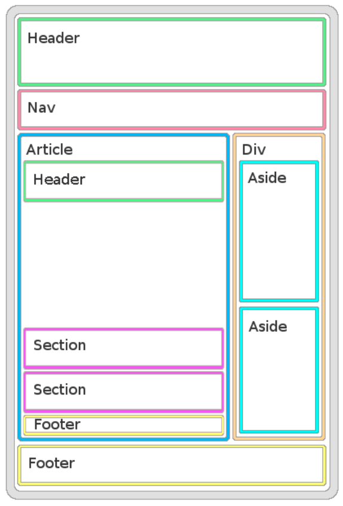

# Estructuras básicas de HTML

Crea un fichero `index.html` que tenga un HTML correspondiente a la imagen siguiente:

Nota: Los textos, bordes y colores son una guia para mostrar los elementos y su posición. El resultado no debe _verse_ así.

El HTML resultante debe ser validado por el [validador de HTML de la W3](https://validator.w3.org/#validate_by_input) y no dar ningún error. No te preocupes si salen warnings por no poner títulos a las sections y el article.
