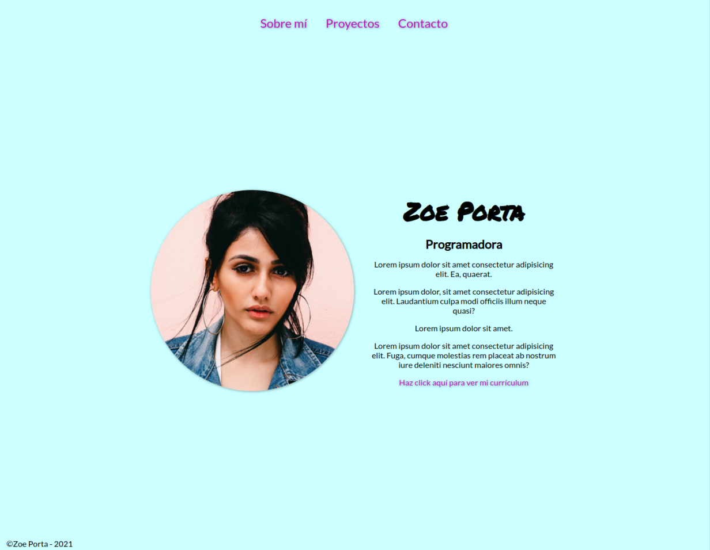

# Sitio web

Crea desde cero la estructura de tu porfolio siguiendo este ejemplo:

**Recuerda que de momento solo debes preocuparte por el contenido y su estructura. NO por cómo se ve.**

El HTML resultante debe ser validado por el [validador de HTML de la W3](https://validator.w3.org/#validate_by_input) y no dar ningún error.
